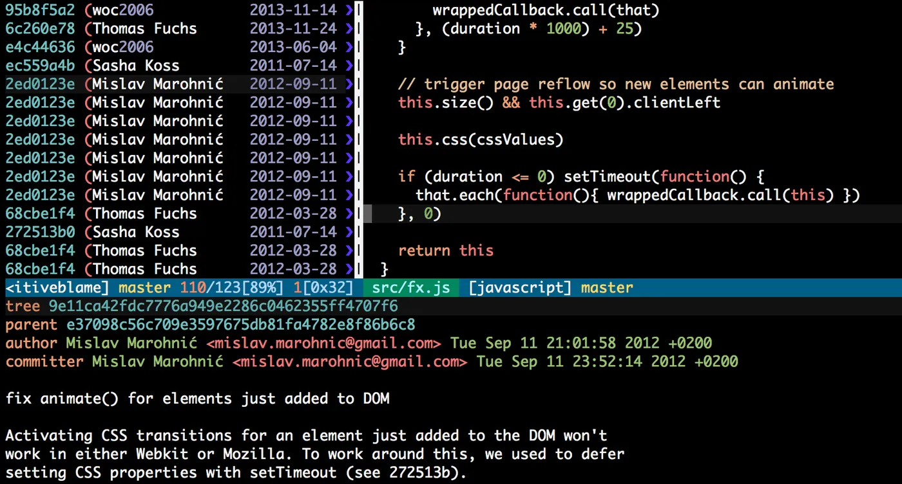

A significant challenge with code maintainability is understanding why the code is the way it is. This includes understanding the trade-offs that were considered, why certain convoluted parts of the codebase can't be simplified, and so on. That's what we use documentation for.

## Using code comments

The common approach to documenting all those code decisions is to introduce code comments.

```javascript
//
// Dear maintainer:
//
// Once you are done trying to 'optimize' this routine,
// and have realized what a terrible mistake that was,
// please increment the following counter as a warning
// to the next guy:
//
// total_hours_wasted_here = 42
//
```

Source: [https://stackoverflow.com/questions/184618/what-is-the-best-comment-in-source-code-you-have-ever-encountered/482129#482129](https://stackoverflow.com/questions/184618/what-is-the-best-comment-in-source-code-you-have-ever-encountered/482129#482129)

However, code comments can quickly become outdated, are often missing when we need them the most, and are perpetually taking up space next to our code.

## Using git

Alternatively, we can use our project's own version control system to better document it! Here's how it works:

1. Every line of code in your repo was introduced at some point in a commit, which you can find with `git blame`
2. Every commit should be atomic, i.e. introducing a single (complete) change, and nothing more
3. Each commit should have a descriptive commit message explaining its unique change, which should include any relevant context like trade-offs and explanations
4. This means now every line of code is documented with helpful and relevant commit messages, along with historical context (git history from that commit)

I was first introduced to this alternative approach to code documentation by an exceptional mentor and former CTO [Joel Chippindale](https://blog.mocoso.co.uk/talks/2015/01/12/telling-stories-through-your-commits/). It was a revelation at the time. Now, every line had helpful, up-to-date documentation that you could summon when needed, at the cost of being a bit more thoughtful with your git history.



_Source: [https://mislav.net/2014/02/hidden-documentation/](https://mislav.net/2014/02/hidden-documentation/)_

I found long, descriptive commit messages incredibly useful for working with large projects. It was disappointing to later find out that other companies weren't following this. I was so used to `git blame`, `git bisect` and travelling through git time for debugging that it felt like losing a superpower.

## Using GitHub

However, now that the [GitHub flow](https://docs.github.com/en/get-started/quickstart/github-flow) is basically an industry standard, we can all replicate this system!

Even if your team pays little attention to commit messages or uses some one-liner rule like [Conventional Commits](https://www.conventionalcommits.org/), they're all still linked to a specific Pull Request.

When you approve and merge a PR on GitHub, it adds a new merge or squashed commit on `main` with those changes. That commit includes the PR id in its message. This means that now every line of code belongs to a commit, which belongs to a merged PR.

Commit messages may not be getting a lot of attention, but PR descriptions are (or should)! We can use [predefined PR templates](https://docs.github.com/en/communities/using-templates-to-encourage-useful-issues-and-pull-requests/creating-a-pull-request-template-for-your-repository), include links to issue trackers or other context, and even add rich media like architecture diagrams, performance benchmark graphics, video walkthroughs of UI changes, and so on. And we also get the full code review discussion, which often adds even more context on many decisions.

So make sure you ship small PRs with atomic changes and add plenty of context on those PR descriptions! Then, enjoy your brand new debugging superpower by using `git blame` to find that line's commit and the corresponding PR with full context.

To sum up, here's the adapted process, which now uses GitHub PR descriptions instead of direct git commit messages:

1. Every line of code in your repo was introduced at some point in a commit, which you can find with `git blame`, which in turn was introduced in a PR, which you can find using the id in the commit message
2. Every PR should be atomic, i.e. introducing a single (complete) change, and nothing more
3. Each PR should have a helpful PR description explaining its unique change, which should include any relevant context like trade-offs and explanations (which, unlike with plain commit messages, can also have rich media and discussions)
4. This means now every line of code is documented with helpful and relevant PR descriptions/discussions, along with historical context (git history from that PR's merge commit)
