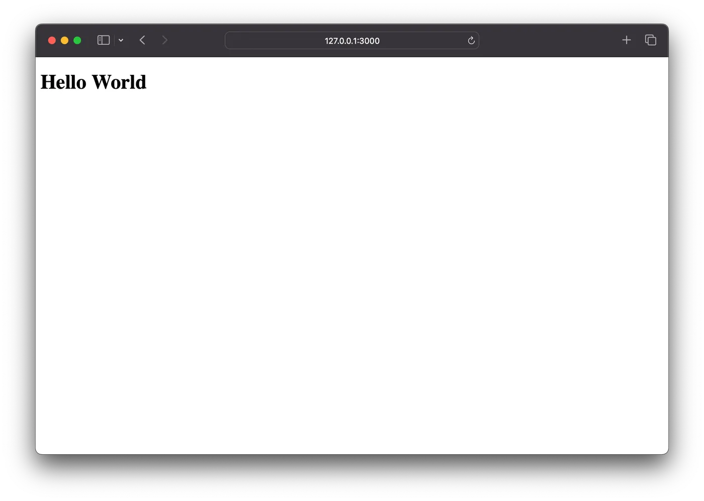
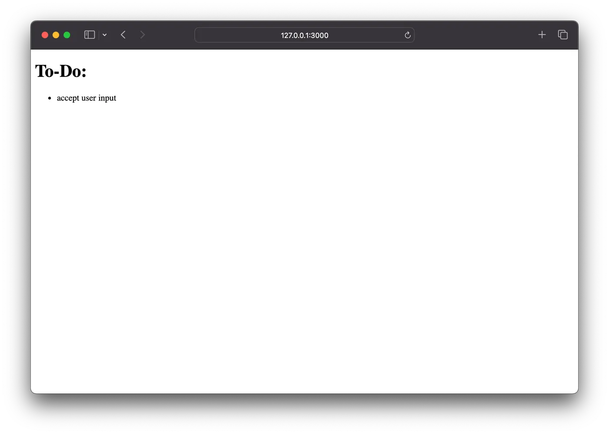
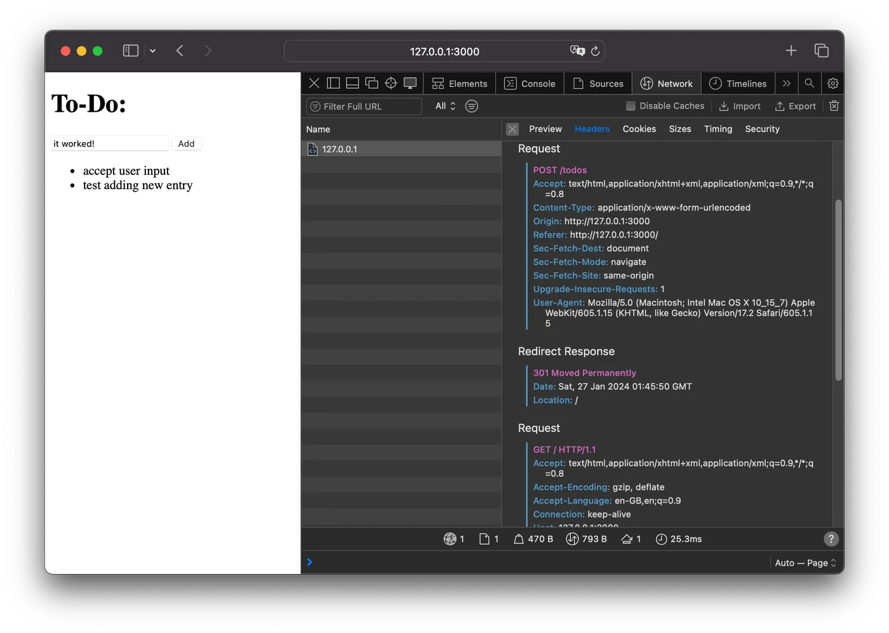
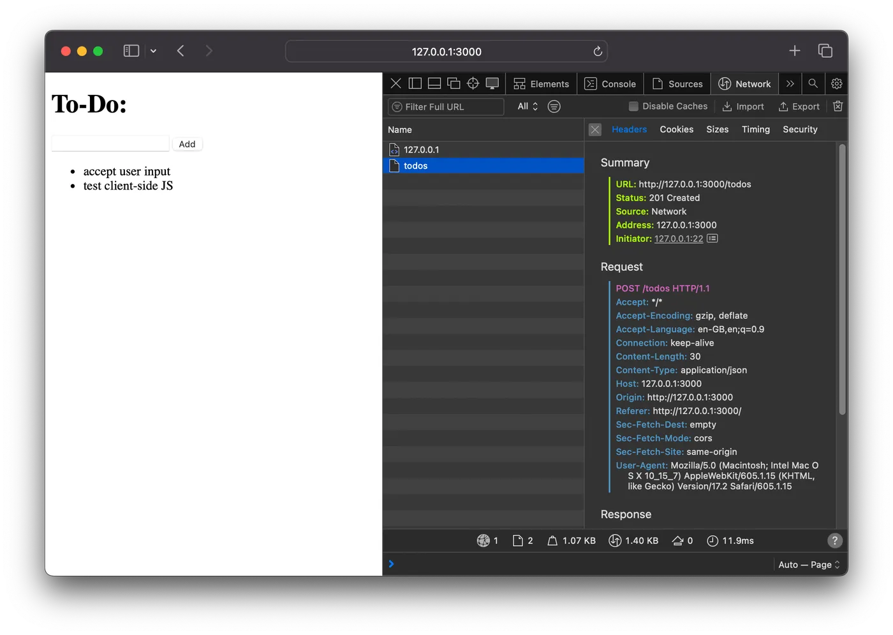

Building web applications seems to be getting more and more complex. Abstractions upon abstractions, and fixes for problems caused by fixes for other problems. But does it have to be this way?

There's a place for complex frameworks and architectures, sure. But for many projects, they may be an overkill.

Let's think through first principles and explore what the web platforms offer by default to see how far we can go before starting to explode complexity. This is a thought exercise to challenge assumptions, not a prescription to blindly follow.

If we browse the [Node.js documentation](https://nodejs.org/en/learn/getting-started/introduction-to-nodejs), we can get a simple working web server:

```javascript
const http = require("node:http");

const hostname = "127.0.0.1";
const port = 3000;

const server = http.createServer((req, res) => {
  res.statusCode = 200;
  res.setHeader("Content-Type", "text/plain");
  res.end("Hello World\n");
});

server.listen(port, hostname, () => {
  console.log(`Server running at http://${hostname}:${port}/`);
});
```

We can test to see if it works:

```plaintext
$ node server.js
Server running at http://127.0.0.1:3000/
```

```plaintext
$ curl http://127.0.0.1:3000
Hello World
```

We can adapt the server to use routes for specific endpoints. For instance, it can reply to requests to `/`, and return 404 otherwise:

```javascript
// GET /
const getIndex = (req, res) => {
  res.statusCode = 200;
  res.setHeader("Content-Type", "text/plain");
  res.end("Hello World\n");
};

const throwNotFound = (req, res) => {
  res.statusCode = 404;
  res.setHeader("Content-Type", "text/plain");
  res.end("Not Found\n");
};

const server = http.createServer((req, res) => {
  if (req.method === "GET" && req.url === "/") {
    getIndex(req, res);
  } else {
    throwNotFound(req, res);
  }
});
```

```plaintext
$ curl -i http://127.0.0.1:3000
HTTP/1.1 200 OK
Content-Type: text/plain
...

Hello World

$ curl -i http://127.0.0.1:3000/hello
HTTP/1.1 404 Not Found
Content-Type: text/plain
...

Not Found
```

Great! We can also return HTML, to serve web pages to the browser:

```javascript
const getIndex = (req, res) => {
  res.statusCode = 200;
  res.setHeader("Content-Type", "text/html; charset=utf-8");
  res.end(`<!DOCTYPE html>
<html lang="en">
  <head>
    <meta charset="UTF-8" />
    <title>My Simple Web Application</title>
    <meta name="viewport" content="width=device-width,initial-scale=1" />
  </head>
  <body>
    <h1>Hello World</h1>
  </body>
</html>`);
};
```

```plaintext
$ curl http://127.0.0.1:3000
<!DOCTYPE html>
<html lang="en">
  <head>
    <meta charset="UTF-8" />
    <title>My Simple Web Application</title>
    <meta name="viewport" content="width=device-width,initial-scale=1" />
  </head>
  <body>
    <h1>Hello World</h1>
  </body>
</html>
```



We can also send dynamic data:

```javascript
// Dynamic list of to-do items (non-persisted)
const todos = ["accept user input"];

// GET /
const getIndex = (req, res) => {
  res.statusCode = 200;
  res.setHeader("Content-Type", "text/html; charset=utf-8");
  res.end(`<!DOCTYPE html>
<html lang="en">
  <head>
    <meta charset="UTF-8" />
    <title>My Simple Web Application</title>
    <meta name="viewport" content="width=device-width,initial-scale=1" />
  </head>
  <body>
    <h1>To-Do:</h1>
    <ul>
${todos.map((todo) => `      <li>${todo}</li>`).join("\n")}
    </ul>
  </body>
</html>\n`);
};
```



And we can add a new endpoint to create new entries for that dynamic data, once again just following the [official documentation](https://nodejs.org/en/guides/anatomy-of-an-http-transaction/#request-body):

```javascript
const querystring = require("node:querystring");

// POST /todos
const postTodo = (req, res) => {
  let body = [];
  req
    .on("data", (chunk) => {
      body.push(chunk);
    })
    .on("end", () => {
      body = Buffer.concat(body).toString();
      const parsedBody = querystring.parse(body);
      if (parsedBody.todo) {
        todos.push(parsedBody.todo);
      }
      res.writeHead(301, { Location: "/" }).end();
    });
};

const server = http.createServer((req, res) => {
  if (req.method === "GET" && req.url === "/") {
    getIndex(req, res);
  } else if (req.method === "POST" && req.url === "/todos") {
    postTodo(req, res);
  } else {
    throwNotFound(req, res);
  }
});
```

```plaintext
$ curl -L http://127.0.0.1:3000/todos -d "todo=test new endpoint"
<!DOCTYPE html>
<html lang="en">
  <head>
    <meta charset="UTF-8" />
    <title>My Simple Web Application</title>
    <meta name="viewport" content="width=device-width,initial-scale=1" />
  </head>
  <body>
    <h1>To-Do:</h1>
    <ul>
      <li>accept user input</li>
      <li>test new endpoint</li>
    </ul>
  </body>
</html>
```

After that, we can add a form to allow adding new entries through the browser:

```javascript
const getIndex = (req, res) => {
  res.statusCode = 200;
  res.setHeader("Content-Type", "text/html; charset=utf-8");
  res.end(`<!DOCTYPE html>
<html lang="en">
  <head>
    <meta charset="UTF-8" />
    <title>My Simple Web Application</title>
    <meta name="viewport" content="width=device-width,initial-scale=1" />
  </head>
  <body>
    <h1>To-Do:</h1>
    <form method="POST" action="/todos">
      <input type="text" name="todo" />
      <button type="submit">Add</button>
    </form>
    <ul>
${todos.map((todo) => `      <li>${todo}</li>`).join("\n")}
    </ul>
  </body>
</html>\n`);
};
```



This may be all good, but it's still only server-side interaction. We want some JavaScript to make client-side interactions that make this feel more like an SPA, without page refreshes. Let's add some progressive enhancement.

The first step is to update the `POST /todos` endpoint to accept JSON requests from client-side JavaScript, in addition to the HTML form it already supported:

```javascript
const postTodo = (req, res) => {
  let body = [];
  req
    .on("data", (chunk) => {
      body.push(chunk);
    })
    .on("end", () => {
      body = Buffer.concat(body).toString();
      const isJson = req.headers["content-type"] === "application/json";
      const parsedBody = isJson ? JSON.parse(body) : querystring.parse(body);
      if (parsedBody.todo) {
        todos.push(parsedBody.todo);
      }
      if (isJson) {
        // Return 201 with HTML list if requested from client-side JS
        res.statusCode = 201;
        res.setHeader("Content-Type", "text/html; charset=utf-8");
        res.end(todos.map((todo) => `      <li>${todo}</li>\n`).join(""));
      } else {
        // Return 301 with redirect to GET / if requested from HTML form
        res.writeHead(301, { location: "/" }).end();
      }
    });
};
```

Notice that the endpoint is returning HTML instead of a JSON object. Both are fine, but HTML responses at least minimise the work required on the client.

With this new support, we can finally add some client-side JavaScript to intercept the form request and use `fetch()` instead, so that we can add a new entry and update the list with no page refresh:

```javascript
const getIndex = (req, res) => {
  res.statusCode = 200;
  res.setHeader("Content-Type", "text/html; charset=utf-8");
  res.end(`<!DOCTYPE html>
<html lang="en">
  <head>
    <meta charset="UTF-8" />
    <title>My Simple Web Application</title>
    <meta name="viewport" content="width=device-width,initial-scale=1" />
  </head>
  <body>
    <h1>To-Do:</h1>
    <form id="add-todo" method="POST" action="/todos" onsubmit="return postTodo();">
      <input type="text" name="todo" />
      <button type="submit">Add</button>
    </form>
    <ul id="todos">
${todos.map((todo) => `      <li>${todo}</li>`).join("\n")}
    </ul>
    <script>
      function postTodo() {
        const todo = document.getElementById("add-todo").todo;
        const ul = document.getElementById("todos");

        fetch("/todos", {
          method: "POST",
          headers: { "Content-Type": "application/json" },
          body: JSON.stringify({ todo: todo.value })
        })
        .then(response => response.text())
        .then(html => {
          ul.innerHTML = html;
          todo.value = "";
        });

        return false;
      }
    </script>
  </body>
</html>\n`);
};
```



It works! It's now sending an `application/json` request that receives a 201 instead of an `application/x-www-form-urlencoded` with a 301 back to the main page.

We could go on. Next, we'd add editing, deleting, persistence, styling, and so on. We could also do some much-needed refactoring, such as extracting request body parsing and building HTML responses. Or moving the client-side JavaScript into its own file that is requested by the HTML page, to avoid that ugly JavaScript inside a template string. But this post is getting long, and hopefully I've already made my point by now.

The full web application so far is a single JavaScript file with 97 lines, including blank lines, comments and some duplicated code that could probably be simplified. And that's enough to power a web application (frontend and backend) with server-side and progressively enhanced client-side data handling. No React, NextJS or even a build step required. No `package.json` file needed to install 184726 dependencies full of security and deprecation warnings. No fear that in 6 months this will no longer run because of breaking changes and incompatibilities.

Am I recommending you to follow this exact approach on your next project? Absolutely not! My point isn't that this is the Right Way and anything else is the Wrong Way. My point is that we can resist the exploding complexity of code and abstractions if we don't need them. There's a place for complex frameworks and architectures, but we don't need to expose ourselves to that complexity elsewhere. Or at least we don't need to start from that point.

Let's celebrate the powerful primitives our platforms already provide us, and climb the exploding complexity ladder only when those primitives are no longer sufficient.
