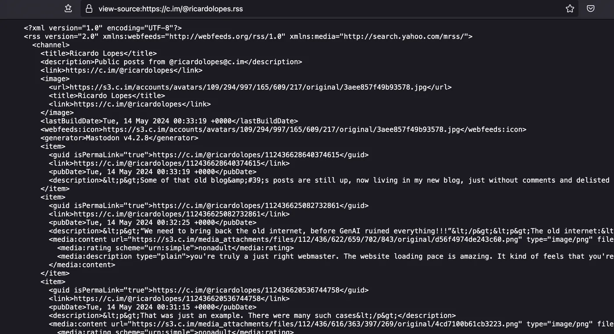
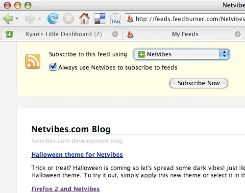
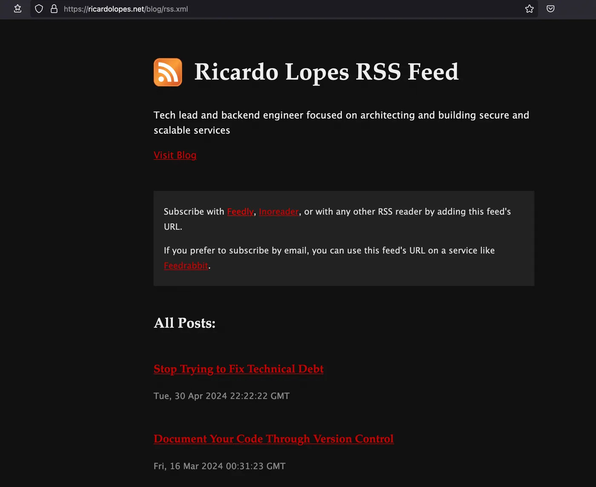

Before we had the walled gardens of social media feeds, there was a wonderful time when sites published their feeds in an open format (RSS) that we could subscribe to, free from dopamine-inducing algorithms, creepy targeted ads, and privacy violations. Most sites still publish an RSS feed, actually, but it gets no visibility and is poorly supported by modern browsers anyway.

I strongly believe we can create a better web for everyone if we champion open standards and decentralisation over proprietary formats and user-hostile monopolies. I'd love to see the return of the RSS feed to challenge the current social media feeds, but it doesn't look like an easy battle.

For starters, we can't get new users to start subscribing to RSS feeds if they don't even know they exist in the first place. We would need websites to announce that option for subscription, like they do with social media handles and newsletters. But let's be honest, that wouldn't be enough.

Even if websites started encouraging visitors to subscribe to their RSS feeds, the user experience would still be terrible. Clicking an RSS link today either opens a raw XML code file in the browser or starts an XML file download. This is an unacceptable experience for new users, who will think something must be broken and will eventually look for other alternatives.

Seriously, this is what browsers today show if you click one of those “Subscribe with RSS” links:



This wasn't always the case. During the peak of RSS, before social media took over, web browsers actually supported it well. You'd see automatic subscribe buttons in the browser's UI, and opening an RSS link would display a styled view where you could see the latest posts and subscribe with your favourite reader.



_Source: [https://www.flickr.com/photos/thickmints/282062844/](https://www.flickr.com/photos/thickmints/282062844/)_

There is a way we can get some of this usability back: by using a technology that's been around for over 20 years, [XSLT](https://www.w3.org/TR/xslt-30/).

An RSS feed is simply an XML file that follows a specific schema. XSLT is a language for transforming XML files into other XML files. We can use an XSLT file to transform an RSS feed (an XML file) into an HTML page (also an XML file, if you don't think too much about the deviations browsers accept these days), complete with CSS and JavaScript. With that transformation, the browser can show a user-friendly HTML page instead of raw XML when you open the RSS feed, and you can still use that feed to subscribe with your favourite reader.

Here's how this blog's RSS feed renders in the browser, thanks to custom XSLT, at the time of writing:



Notice that it's still an XML file that works with any RSS reader, but it displays as a regular web page in the browser. The design isn't the best, but that's merely a design skills issue from yours truly.

With a styled presentation like that (or hopefully a better-looking one), we can finally improve the user experience of subscribing with RSS. We can display the list of the most recent posts, educate the visitor on how to go from this page to actually being subscribed in an RSS reader of their choice, along with anything else we can think of.

Here's how you can do the same for your own RSS feed:

First, you need to create the actual XSLT file that transforms from the RSS schema into an HTML page. The file should have a structure like this:

```xml
<xsl:stylesheet version="3.0">
  <xsl:output method="html" version="1.0" encoding="UTF-8" indent="yes"/>
  <xsl:template match="/">
    <html lang="en">
      ...
    </html>
  </xsl:template>
</xsl:stylesheet>
```

Inside the `xsl:template` tag, you can write any HTML just as you would on any web page, starting, of course, with the usual `html` tag. That includes, for instance, CSS styles:

```xml
<head>
  <meta http-equiv="Content-Type" content="text/html; charset=utf-8"/>
  <meta name="viewport" content="width=device-width, initial-scale=1, maximum-scale=1"/>
  <style type="text/css">
    ...
  </style>
  ...
</head>
```

Then, you can use specific `xsl` tags to pull data from the source XML file into the new template. For instance, `<xsl:value-of select="/rss/channel/title"/>` returns the value in the RSS's `rss/channel/title` path, which would be the blog's title. To show all blog post titles, you could use:

```xml
<ul>
  <xsl:for-each select="/rss/channel/item">
    <li><xsl:value-of select="title"/></li>
  </xsl:for-each>
</ul>
```

This example iterates through all `item` entries in the RSS's `rss/channel` path and outputs the value of the `title` tag in each of those `item`s.

This is just a quick glimpse of what we can do with XSLT. This post isn't meant to be a full tutorial on the subject. For more inspiration, you can check out this blog's own XSLT file at [/blog/rss.xsl](/blog/rss.xsl).

After you've created your template, you only need to add these two lines at the top of your RSS file:

```xml
<?xml version="1.0" encoding="UTF-8"?>
<?xml-stylesheet href="<link/to/your/xslt/file.xsl>" type="text/xsl"?>
```

Here's an example of this blog's feed, which you can check by clicking “view source” at [/blog/rss.xml](/blog/rss.xml):

```xml
<?xml version="1.0" encoding="UTF-8"?>
<?xml-stylesheet href="https://rplopes.com/blog/rss.xsl" type="text/xsl"?>
<rss version="2.0" xmlns:atom="http://www.w3.org/2005/Atom" xmlns:dc="http://purl.org/dc/elements/1.1/">
  ...
</rss>
```

The biggest drawback to this approach is, of course, that it will only work if you have control over how your RSS feed is generated. If it's provided by an external provider, chances are you can't add the lines needed to get the XSLT to style it.

Shoutout to the original blog posts that inspired me to give this a go and share what I've done:

- [Pretty RSS Feeds](https://brandonrozek.com/blog/pretty-rss-feeds/) by [Brandon Rozek](https://brandonrozek.com/), which was inspired by
- [pretty-feed.xsl](https://github.com/genmon/aboutfeeds/blob/main/tools/pretty-feed-v3.xsl) by [Matt Webb](https://interconnected.org/), which in turn was inspired by
- [How to style RSS feed](https://lepture.com/en/2019/rss-style-with-xsl) by [lepture](https://lepture.com/)

If you also want to support a more open web based on independent sites and feeds instead of social media silos, consider making this change to your RSS feeds or advocating for it elsewhere. It’s not much, but it’s a start.
